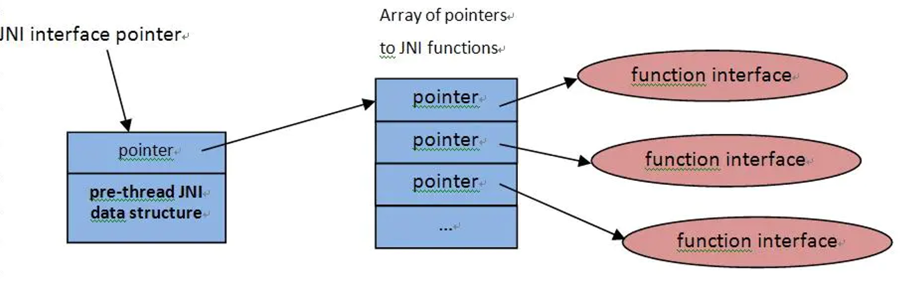

# Android JNI学习(一) NDK与JNI基础


本片文章大纲如下：

- 1、导读
- 2、什么是NDK
- 3、为什么使用NDK
- 4、NDK到SO
- 5、JNI


## 一、导读

在Android OS上开发应用程序，Google提供了两种开发包：SDK和NDK。你可以从Google官方查阅到有许多关于SDK的优秀书籍、文章作为参考，但是Google提供的NDK资源，相对于SDK还是比较少的。本系列文章主要是用于，自己记录自学NDK的经验，并且希望能够帮助到哪些想学习NDK的朋友。

Android 平台从一开就已经支持了C/C++了。我们知道Android的SDK主要是基于Java的，所以导致了在用Android SDK进行开发的工程师们都必须使用Java语言。不过，Google从一开始就说明Android也支持JNI编程方式，也就是第三方应用完成可以通过JNI调用自己的C动态度。于是NDK就应运而生了。

## 二、什么是NDK

##### NDK 其中NDK的全拼是：Native Develop Kit。

那我们先来看下[Android NDK官网](https://link.jianshu.com?t=https%3A%2F%2Fdeveloper.android.google.cn%2Fndk%2Findex.html)是对NDK怎么解释的


**关键文字如下：**

Android NDK 是一套允许您使用原生代码语言(例如C和C++) 实现部分应用的工具集。在开发某些类型应用时，这有助于您重复使用以这些语言编写的代码库。

**简单的来说:*

Android NDK 就是一套工具集合，允许你使用C/C++ 语言来实现应用程序的部分功能。

NDK 是Native Develop Kit的含义，从含义很容易理解，本地开发。大家都知道，Android 开发语言是Java，不过我们也知道，Android是基于Linux的，其核心库很多都是 C/C++ 的，比如Webkit等。那么NDK的作用，就是Google为了提供给开发者一个在Java中调用C/C++ 代码的一个工作。NDK本身其实就是一个交叉工作链，包含了Android上的一些库文件，然后，NDK为了方便使用，提供了一些脚本，使得更容易的编译C/C++ 代码。总之，在Android的SDK之外，有一个工具就是NDK，用于进行 C/C++ 的开发。一般情况，是用 NDK 工具把 C/C++ 编译为 . so 文件，然后在Java中调用。

NDK不适用于大多数初学的Android工程师，对于许多类型的Android应用没有什么价值。因为它不可避免地会增加开发过程的复杂性，所以一般很少使用。那为什么Google还提供 NDK，我们就一起研究下

## 三、为什么使用NDK

上面提及了 NDK不适合大多数初级Android 工程师，由于它增加了开发的复杂度，所以对许多类型的 Android 其实也没有大的作用。不过在下面的需求下，NDK还是有很大的价值的：

- 1、在平台之间移植其应用
- 2、重复使用现在库，或者提供其自己的库重复使用
- 3、在某些情况下提性能，特别是像游戏这种计算密集型应用
- 4、使用第三方库，现在许多第三方库都是由 C/C++ 库编写的，比如 ffmpeg 这样的库。
- 5、不依赖于 Dalvik Java 虚拟机的设计
- 6、代码的保护。由于 APK 的 Java 层代码很容易被反编译，而 C/C++ 库反编译难度大。

## 四、NDK到 so


从上图这个Android系统框架来看，我们上层通过JNI来调用NDK层的，使用这个工具可以很方便的编写和调试JNI的代码。因为C语言的不跨平台，在Mac系统的下使用NDK编译在Linux下能执行的函数库——so文件。其本质就是一堆C、C++ 的头文件和实现文件打包成一个库。目前Android系统支持以下七种不同的CPU架构，每一种对应着各自的应用程序二进制接口ABI：(Application Binary Interface)定义了二进制文件(尤其是.so文件)如何运行在相应的系统平台上，从使用的指令集，内存对齐到可用的系统函数库。对应关系如下：

- ARMv5——armeabi
- ARMv7 ——armeabi-v7a
- ARMv8——arm64- v8a
- x86——x86
- MIPS ——mips
- MIPS64——mips64
- x86_64——x86_64

## 五、JNI

#### (一) 什么是JNI?

[oracle中关于JNI的指导](https://link.jianshu.com?t=https%3A%2F%2Fdocs.oracle.com%2Fjavase%2F6%2Fdocs%2Ftechnotes%2Fguides%2Fjni%2F)

Java调用C/C++ 在Java语言里面本来就有的，并非Android自创的，即JNI。JNI就是Java调用C++ 的规范。当然，一般的Java程序使用的JNI标准可能和android不一样，Android的JNI更简单。

JNI，全称为Java Native Interface，即Java本地接口，JNI是Java调用Native 语言的一种特性。通过JNI可以使得Java与C/C++机型交互。即可以在Java代码中调用C/C++ 等语言的代码或者在 C/C++ 代码中调用Java代码。由于JNI是JVM规范的一部分，因此可以将我们写的JNI的程序在任何实现了JNI规范的Java虚拟机中运行。同时，这个特性使我们可以复用以前用 C/C++ 写的大量代码 JNI 是一种在Java虚拟机机制下的执行代码的标准机制。代码被编写成汇编程序或者 C/C++ 程序，并组装为动态库。也就允许非静态绑定用法。这提供了一个在Java平台上调用 C/C++ 的一种途径，反之亦然。

PS：开发JNI程序会受到系统环境限制，因为用C/C++ 语言写出来的代码或模块，编译过程当中要依赖当前操作系统环境所提供的一些库函数，并和本地库链接在一起。而且编译后生成的二进制代码只能在本地操作系统环境下运行，因为不同的操作系统环境，有自己的本地库和CPU指令集，而且各个平台对标准 C/C++ 的规范和标准库函数实现方式也有所区别。这就造成了各个平台使用JNI接口的Java程序，不再像以前那样自由的跨平台。如果要实现跨平台， 就必须将本地代码在不同的操作系统平台下编译出相应的动态库。

#### (二) 为什么需要JNI

因为在实际需求中，需要Java代码与C/C++ 代码进行交互，通过JNI可以实现Java代码与C/C++ 代码的交互

#### (三) JNI的优势

与其它类似接口Microsoft的原始本地接口等相比，JNI的主要竞争优势在于：它在设计之初就确保了二进制的兼容性，JNI编写的应用程序兼容性以及其在某些具体平台上的 Java 虚拟机兼容性(当谈及JNI时，这里并不特别针对Davik虚拟机，JNI适用于所有JVM虚拟机)。这就是为什么C/C++ 编译后的代码无论在任何平台上都能执行。不过，一些早期版本并不支持二进制兼容。二进制兼容性是一种程序兼容性类型，允许一个程序在不改变其可执行文件的条件下在不同的编译环境中工作。

#### (四) JNI的三个角色


JNI下一共涉及到三个角色：C/C++代码、本地方法接口类、Java层中具体业务类。

JNI简要流程


#### (五) JNI的命名规则

随便举例如下：

```
JNIExport jstring JNICALL Java_com_example_hellojni_MainActivity_stringFromJNI(JNIEnv* env,j object this) 
```

`jstring `是返回值类型
` Java_com_example_hellojni `是包名
`MainActivity`是类名
` stringFromJNI`是方法名

**其中**`JNIExport`**和**`JNICALL`**是固定保留的关键字不要修改**

#### (六) 如何实现JNI

JNI开发流程的步骤：

- 第1步：在 Java 中先声明一个 native方法
- 第2步：编译 Java 源文件 javac 得到 .class 文件
- 第3步：通过 javah -jni 命令导出 JNI 的 .h 头文件
- 第4步：使用 Java 需要交互的本地代码，实现在 Java 中声明的 Native 方法（如果 Java 需要与 C++ 交互，那么就用 C++ 实现 Java 的 Native 方法。）
- 第5步：将本地代码编译成动态库(Windows 系统下是  .dll 文件，如果是 Linux 系统下是 .so 文件，如果是 Mac 系统下是 .jnilib)
- 第6步：通过 Java 命令执行 Java 程序，最终实现 Java 调用本地代码。

PS：**javah是JDK自带的一个命令，-jni参数表示将class 中用到native声明的函数生成JNI 规则的函数**

如下图：


 

#### (七) JNI结构



这张 JNI 函数表的组成就像C++ 的虚函数表。虚拟机可以运行多张函数表，举例来说，**一张调试函数表**，**另一张是调用函数表**。JNI 接口指针仅在当前线程中起作用。这意味着指针不能从一个线程进入另一个线程。然而，可以在不同的线程中调用本地方法。


示例代码

```
jdouble Java_pkg_Cls_f__ILjava_lang_String_2(JNIEnv *env, jobject obj, jint i, jstring s)
{
     const char *str = (*env)->GetStringUTFChars(env, s, 0); 
     (*env)->ReleaseStringUTFChars(env, s, str); 
     return 10;
}
```

里面的方法有三个入参，我们就依次来看下：

- *env：一个接口指针
- obj：在本地方法中声明的对象引用
- i 和 s：用于传递的参数

关于obj、i和s的类型大家可以参考下面的JNI数据类型，JNI有自己的原始数据类型和数据引用类型如下：


关于 env，会在下面 JNI 原理中讲解。

#### (八) JNI原理

在计算机系统中，每一种编程语言都有一个执行环境(Runtime)，执行环境用来解释执行语言中的语句，不同的编程语言的执行环境就好比神话世界中的"阴阳两界"一样，一般人不能同时生存在阴阳两界中，只有一些特殊的仙人——"黑白无常"才能自由穿梭在"阴阳两界"，而"黑白无常"往返于阴阳两界时手持生日薄，"黑白无常"按生死薄上记录的任命来"索魂"。

Java语言的执行环境是Java虚拟机(JVM)，JVM其实是主机环境中的一个进程，每个JVM虚拟机都在本地环境中有一个JavaVM结构体，该结构体在创建Java虚拟机时被返回，在JNI环境中创建JVM的函数为**JNI_CreateJavaVM**。

```
JNI_CreateJavaVM(JavaVM **pvm, void **penv, void *args);
```

##### 1、JavaVM


其中JavaVM是Java虚拟机在JNI层的代表，JNI全局仅仅有一个JavaVM。结构中封装了一些函数指针（或叫函数表结构），JavaVM中封装的这些函数指针主要是对JVM操作接口。另外，在C和C++ 中的JavaVM的定义有所不同，在C中JavaVM是 JNIInvokeInterface_ 类型指针，而在 C++ 中又对 JNIInvokeInterface_ 进行了一次封装，比C中少了一个参数，这也是为什么JNI代码更推荐使用C++ 来编写的原因。

下面我们来重点说一下JNIEnv

##### 2、JNIEnv

JNIEnv是当前Java线程的执行环境，一个JVM对应一个JavaVM结构，而一个JVM中可能创建多个Java线程，每个线程对应一个JNIEnv结构，它们保存在线程本地存储TLS中。因此，不同的线程的JNIEnv是不同，也不能相互共享使用。JNIEnv结构也是一个函数表，在本地代码中通过JNIEnv的函数表来操作Java数据或者调用Java方法。也就是说，只要在本地代码中拿到了JNIEnv结构，就可以在本地代码中调用Java代码。


##### 2.1 JNIEnv是什么？

JNIEnv是一个线程相关的结构体，该结构体代表了Java在本线程的执行环境

##### 2.2、JNIEnv 和 JavaVM的区别：

- JavaVM：JavaVM是Java虚拟机在JNI层的代表，JNI全局仅仅有一个
- JNIEnv：JavaVM     在线程中的代码，每个线程都有一个，JNI可能有非常多个JNIEnv；

##### 2.3、JNIEnv的作用：

- 调用Java函数：JNIEnv代表了Java执行环境，能够使用JNIEnv调用Java中的代码
- 操作Java代码：Java对象传入JNI层就是jobject对象，需要使用JNIEnv来操作这个Java对象

##### 2.4、JNIEnv的创建与释放

##### 2.4.1、JNIEnv的创建

JNIEnv 创建与释放：从JavaVM获得，这里面又分为C与C++，我们就依次来看下：

- C 中——**JNIInvokeInterface**：JNIInvokeInterface是C语言环境中的JavaVM结构体，调用     (*AttachCurrentThread)(JavaVM*, JNIEnv**, void*)     方法，能够获得JNIEnv结构体
- C++中 ——**_JavaVM**：_JavaVM是C++中JavaVM结构体，调用jint     AttachCurrentThread(JNIEnv** p_env, void* thr_args) 方法，能够获取JNIEnv结构体；

##### 2.4.2、JNIEnv的释放

- C 中释放：调用JavaVM结构体JNIInvokeInterface中的(*DetachCurrentThread)(JavaVM*)方法，能够释放本线程的JNIEnv
- C++     中释放：调用JavaVM结构体_JavaVM中的jint DetachCurrentThread(){ return     functions->DetachCurrentThread(this); } 方法，就可以释放 本线程的JNIEnv

##### 2.5、JNIEnv与线程

JNIEnv是线程相关的，即在每一个线程中都有一个JNIEnv指针，每个JNIEnv都是线程专有的，其他线程不能使用本线程中的JNIEnv，即线程A不能调用线程B的JNIEnv。所以JNIEnv不能跨线程。

- JNIEnv只在当前线程有效：JNIEnv仅仅在当前线程有效，JNIEnv不能在线程之间进行传递，在同一个线程中，多次调用JNI层方便，传入的JNIEnv是同样的
- 本地方法匹配多个JNIEnv：在Java层定义的本地方法，能够在不同的线程调用，因此能够接受不同的JNIEnv

##### 2.6、JNIEnv结构

JNIEnv是一个指针，指向一个线程相关的结构，线程相关结构，线程相关结构指向JNI函数指针数组，这个数组中存放了大量的JNI函数指针，这些指针指向了详细的JNI函数。


##### 2.7、与JNIEnv相关的常用函数

##### 2.7.1 创建Java中的对象

- jobject NewObject(JNIEnv     *env, jclass clazz,jmethodID methodID, ...)：
- jobject NewObjectA(JNIEnv     *env, jclass clazz,jmethodID methodID, const jvalue *args)：
- jobject NewObjectV(JNIEnv     *env, jclass clazz,jmethodID methodID, va_list args)：

第一个参数jclass class 代表的你要创建哪个类的对象，第二个参数,jmethodID methodID代表你要使用那个构造方法ID来创建这个对象。只要有jclass和jmethodID，我们就可以在本地方法创建这个Java类的对象。

##### 2.7.2 创建Java类中的String对象

- jstring NewString(JNIEnv     *env, const jchar *unicodeChars,jsize len)：

通过Unicode字符的数组来创建一个新的String对象。
 env是JNI接口指针；unicodeChars是指向Unicode字符串的指针；len是Unicode字符串的长度。返回值是Java字符串对象，如果无法构造该字符串，则为null。

那有没有一个直接直接new一个utf-8的字符串的方法呢？答案是有的，就是`jstring NewStringUTF(JNIEnv *env, const char *bytes)`这个方法就是直接new一个编码为utf-8的字符串。

##### 2.7.3 创建类型为基本类型PrimitiveType的数组

- ArrayType     New<PrimitiveType>Array(JNIEnv *env, jsize length);
       指定一个长度然后返回相应的Java基本类型的数组

| **方法**                         | **返回值**    |
| -------------------------------- | ------------- |
| New<PrimitiveType>Array Routines | Array Type    |
| NewBooleanArray()                | jbooleanArray |
| NewByteArray()                   | jbyteArray    |
| NewCharArray()                   | jcharArray    |
| NewShortArray()                  | jshortArray   |
| NewIntArray()                    | jintArray     |
| NewLongArray()                   | jlongArray    |
| NewFloatArray()                  | jfloatArray   |
| NewDoubleArray()                 | jdoubleArray  |

用于构造一个新的数组对象，类型是原始类型。基本的原始类型如下：

| **方法**                         | **返回值**    |
| -------------------------------- | ------------- |
| New<PrimitiveType>Array Routines | Array Type    |
| NewBooleanArray()                | jbooleanArray |
| NewByteArray()                   | jbyteArray    |
| NewCharArray()                   | jcharArray    |
| NewShortArray()                  | jshortArray   |
| NewIntArray()                    | jintArray     |
| NewLongArray()                   | jlongArray    |
| NewFloatArray()                  | jfloatArray   |
| NewDoubleArray()                 | jdoubleArray  |

##### 2.7.4 创建类型为elementClass的数组

- jobjectArray     NewObjectArray(JNIEnv *env, jsize length,
       jclass elementClass, jobject initialElement);

造一个新的数据组，类型是elementClass，所有类型都被初始化为initialElement。

##### 2.7.5 获取数组中某个位置的元素

jobject GetObjectArrayElement(JNIEnv *env,
 jobjectArray array, jsize index);

返回Object数组的一个元素

##### 2.7.6 获取数组的长度

jsize GetArrayLength(JNIEnv *env, jarray array);

获取array数组的长度.

关于JNI的常用方法，我们会在后面一期详细介绍。文档可以参考[https://docs.oracle.com](https://link.jianshu.com?t=https%3A%2F%2Fdocs.oracle.com%2Fjavase%2F1.5.0%2Fdocs%2Fguide%2Fjni%2Fspec%2FjniTOC.html)

#### (九) JNI的引用

Java内存管理这块是完全透明的，new一个实例时，只知道创建这个类的实例后，会返回这个实例的一个引用，然后拿着这个引用去访问它的成员(属性、方法)，完全不用管JVM内部是怎么实现的，如何为新建的对象申请内存，使用完之后如何释放内存，只需要知道有个垃圾回收器在处理这些事情就行了，然而，从Java虚拟机创建的对象传到C/C++代码就会产生引用，根据Java的垃圾回收机制，只要有引用存在就不会触发该该引用所指向Java对象的垃圾回收。

在JNI规范中定义了三种引用：局部引用（Local Reference）、全局引用（Global Reference）、弱全局引用（Weak Global Reference）。区别如下：

在JNI中也同样定义了类似与Java的应用类型，在JNI中，定义了三种引用类型：

- 局部引用(Local Reference)
- 全局引用(Global Reference)
- 弱全局引用(Weak Global     Reference)

下面我们就依次来看下：

##### 1、局部引用(Local Reference)

局部引用，也成本地引用，通常是在函数中创建并使用。会阻止GC回收所有引用对象。

最常见的引用类型，基本上通过JNI返回来的引用都是局部引用，例如使用NewObject，就会返回创建出来的实例的局部引用，局部引用值在该native函数有效，所有在该函数中产生的局部引用，都会在函数返回的时候自动释放(freed)，也可以使用DeleteLocalRef函数手动释放该应用。之所以使用DeleteLocalRef函数：实际上局部引用存在，就会防止其指向对象被垃圾回收期回收，尤其是当一个局部变量引用指向一个很庞大的对象，或是在一个循环中生成一个局部引用，最好的做法就是在使用完该对象后，或在该循环尾部把这个引用是释放掉，以确保在垃圾回收器被触发的时候被回收。在局部引用的有效期中，可以传递到别的本地函数中，要强调的是它的有效期仍然只是在第一次的Java本地函数调用中，所以千万不能用C++全部变量保存它或是把它定义为C++静态局部变量。

##### 2、全局引用(Global Reference)

全局引用可以跨方法、跨线程使用，直到被开发者显式释放。类似局部引用，一个全局引用在被释放前保证引用对象不被GC回收。和局部应用不同的是，没有俺么多函数能够创建全局引用。能创建全部引用的函数只有NewGlobalRef，而释放它需要使用ReleaseGlobalRef函数

##### 3、弱全局引用(Weak Global Reference)

是JDK 1.2 新增加的功能，与全局引用类似，创建跟删除都需要由编程人员来进行，这种引用与全局引用一样可以在多个本地带阿妈有效，不一样的是，弱引用将不会阻止垃圾回收期回收这个引用所指向的对象，所以在使用时需要多加小心，它所引用的对象可能是不存在的或者已经被回收。

通过使用NewWeakGlobalRef、ReleaseWeakGlobalRef来产生和解除引用。

##### 4、引用比较

在给定两个引用，不管是什么引用，我们只需要调用IsSameObject函数来判断他们是否是指向相同的对象。代码如下：

```
(*env)->IsSameObject(env, obj1, obj2)
```

如果obj1和obj2指向相同的对象，则返回**JNI_TRUE(****或者1)**，否则返回**JNI_FALSE(****或者0)**,

PS：有一个特殊的引用需要注意：NULL，JNI中的NULL引用指向JVM中的null对象，如果obj是一个全局或者局部引用，使用`(*env)->IsSameObject(env, obj, NULL)`或者`obj == NULL`用来判断obj是否指向一个null对象即可。但是需要注意的是，`IsSameObject`用于弱全局引用与NULL比较时，返回值的意义是不同于局部引用和全局引用的。代码如下：

```
jobject local_obj_ref = (*env)->NewObject(env, xxx_cls,xxx_mid);
jobject g_obj_ref = (*env)->NewWeakGlobalRef(env, local_ref);
// ... 业务逻辑处理
jboolean isEqual = (*env)->IsSameObject(env, g_obj_ref, NULL);
```

 

 